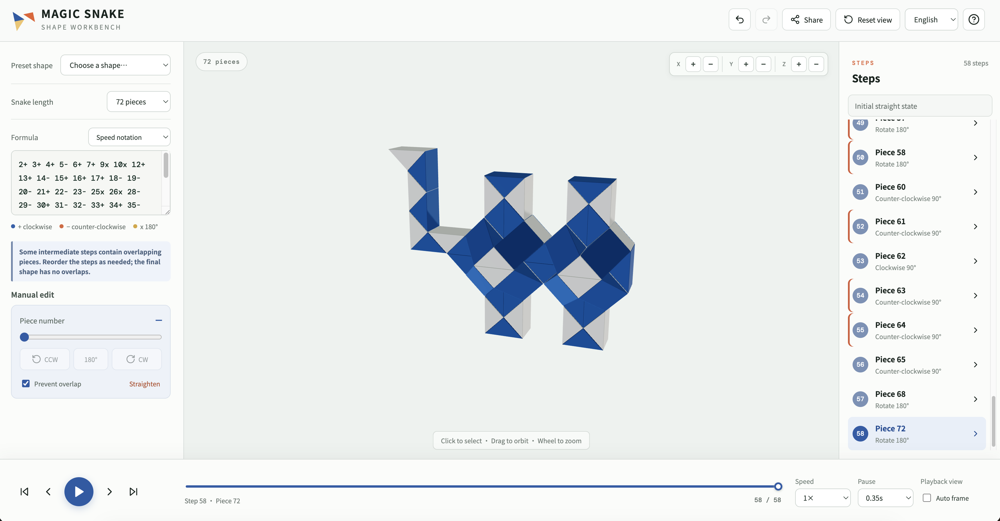

# 魔尺造型工作台

一个在浏览器中编辑和演示魔尺造型的纯前端工具，支持 24、36、48 和 72 段魔尺。



## 功能

- 在 3D 视图中选择方块并旋转对应关节
- 输入或转换 0123 编码、标准速拧和括号公式
- 浏览内置造型并逐步播放折叠过程
- 精确检查最终姿态中的方块重叠
- 自动调整播放视口，并支持鼠标和六轴按钮控制镜头
- 通过 URL 哈希分享当前造型
- 中文和英文界面

## 本地运行

需要 Node.js 和 npm。

```bash
npm install
npm run dev
```

浏览器打开终端显示的本地地址即可使用。

## 检查与构建

```bash
npm run lint
npm test
npm run build
```
